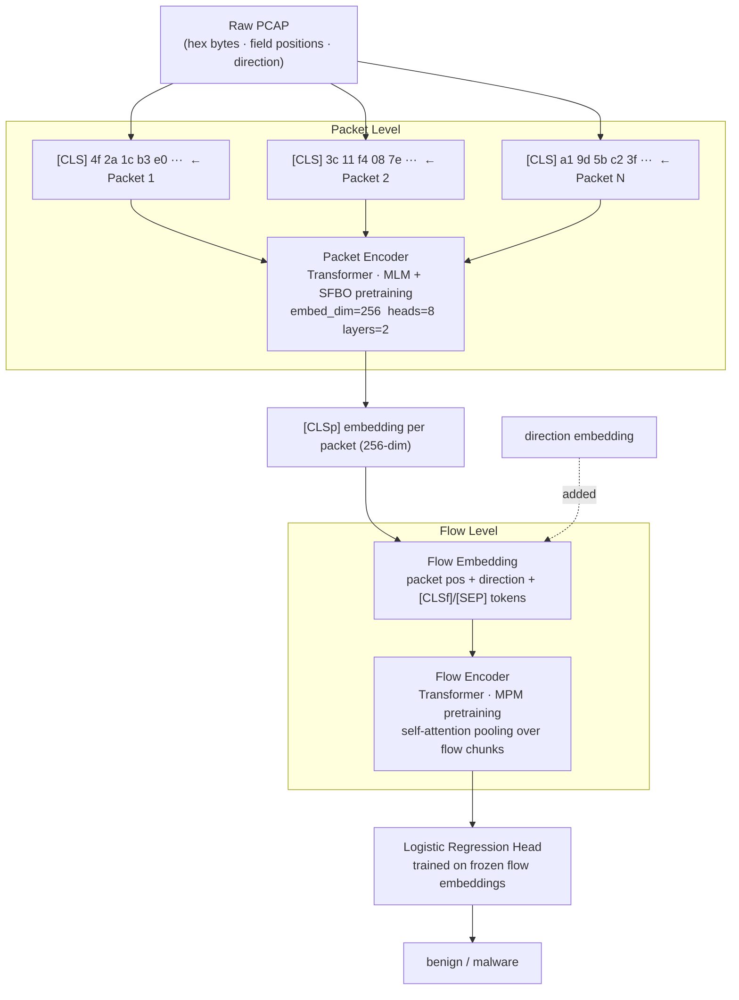

# SPARKLE — Network Traffic Classification

SPARKLE is a research project for network traffic classification using **NetLM**, a two-level transformer pretrained on raw packet bytes. NetLM learns representations of network flows without hand-crafted features — it reads raw hex bytes directly.

---

## NetLM Architecture



NetLM has two stacked transformers:

**Packet Encoder** — reads a single packet as a sequence of byte tokens. Each token is embedded using three additive embeddings: byte value, field position (which header field the byte belongs to), and header position. Pretrained with two objectives: Masked Language Modelling (MLM, 15% random token masking) and Span-Field Blank-Out (SFBO, masking all tokens belonging to a randomly selected set of header fields). The [CLS] token output is used as the packet embedding.

**Flow Encoder** — reads a sequence of [CLS] packet embeddings. Direction (client→server or server→client) is added as a learned embedding at the flow level. Long flows are split into chunks of 510 packets with [CLSf] and [SEP] tokens; a self-attention pooling layer aggregates across chunks. Pretrained with Masked Packet Modelling (MPM), which replaces packet embeddings with noise and trains the model to recover the original representation via cosine similarity.

For classification, the flow encoder is used as a frozen feature extractor and a logistic regression head is trained on top.

---

## Evaluation

Evaluated on [CIC-IDS-2017](https://www.unb.ca/cic/datasets/ids-2017.html) (binary: benign vs malware) and USTC-TFC2016 (10 malware families + benign).

**Split methodology:** flows are grouped by source PCAP file; the split is done at the PCAP level using `GroupShuffleSplit`. All flows from the same capture session go entirely into train or entirely into test — never split across both. This prevents the classifier from exploiting session-level correlations (shared IPs, timing, background noise).

Enforced with a hard assertion:
```python
assert not overlap, f"LEAKAGE: PCAPs present in both train and test: {overlap}"
```

**Results (binary classification on CIC-IDS-2017):**

| Split | Accuracy |
|---|---|
| Grouped by source PCAP | **86.0%** |

---

## Data Format

Each manifest entry points to four text files per flow: raw packet hex dumps, parsed header field positions, structured header fields, and per-packet direction labels (1 = client→server, 2 = server→client).

```json
[
  {
    "flow": "flow_001",
    "label": 1,
    "label_name": "Benign",
    "source_pcap": "Monday-WorkingHours.pcap",
    "packet":    "s3://netml-s3-bucket/.../packets/0001.txt",
    "header":    "s3://netml-s3-bucket/.../header/0001.txt",
    "field":     "s3://netml-s3-bucket/.../fields/0001.txt",
    "direction": "s3://netml-s3-bucket/.../direction/0001.txt"
  }
]
```

Dataset split (CIC-IDS-2017):
```
Total: 239,223 flows
Train: 203,339  |  Val: 17,941  |  Test: 17,943
```

---

## Setup

Requires [uv](https://docs.astral.sh/uv/).

```bash
curl -LsSf https://astral.sh/uv/install.sh | sh
uv sync
```

### Pretraining

```bash
uv run python -m sparkle.model.scripts.train
```

### Evaluation (grouped, leakage-free)

```bash
uv run python -m sparkle.model.scripts.evaluate_classification_grouped \
  --manifest data/manifest.json \
  --checkpoint checkpoints/checkpoint_1.pth
```

### Binary classification (benign vs malware)

```bash
uv run python src/sparkle/model/scripts/evaluate_classification_binary.py \
  --manifest data/ustc_preprocessed_by_flow/manifest.json \
  --checkpoint checkpoints/checkpoint_1.pth

# Augment embeddings with per-flow payload statistics (mean/max/total payload bytes,
# fraction of packets carrying application-layer payload):
uv run python src/sparkle/model/scripts/evaluate_classification_binary.py \
  --manifest data/ustc_preprocessed_by_flow/manifest.json \
  --checkpoint checkpoints/checkpoint_1.pth \
  --payload
```

---

## Repo Structure

```
sparkle/
├── Pre Processing/
│   ├── preprocessing/      # PCAP → hex dumps, field/header extraction
│   ├── scapy/              # Packet parsing utilities
│   └── dropbox upload/     # S3 upload scripts
├── src/sparkle/
│   ├── configs/config.py   # Hyperparameters (embed_dim=256, heads=8, layers=2)
│   ├── data_loader/        # Dataset, tokenizer, manifest handling
│   │   └── tokenizer/      # Byte-level vocab (262 tokens)
│   └── model/
│       ├── packet_encoder.py              # Packet-level transformer + MLM/SFBO
│       ├── flow_encoder.py                # Flow-level transformer + MPM + self-attn pooling
│       ├── embedding.py                   # PacketEmbedding, FlowEmbedding
│       └── scripts/
│           ├── train.py
│           ├── evaluate_classification_grouped.py
│           └── evaluate_classification_binary.py
├── checkpoints/
├── results/                # Evaluation results and analysis
│   └── IMPROVEMENT_PLAN.md # Detailed roadmap for deployment
├── evaluation/             # Documentation and detailed findings
└── pyproject.toml
```

---

## Contributors

- [Satvik](https://github.com/satvik13o7/)
- [Kavish Kashyap](https://github.com/Real-Professor/)
- [Arnav Garg](https://github.com/dorkcubed/)
- [Atharva Gupta](https://github.com/atharva7-g/)
